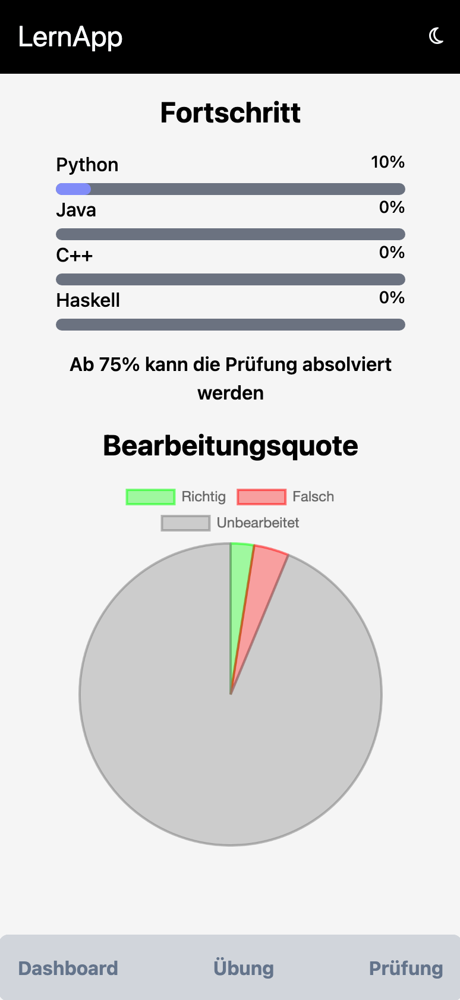
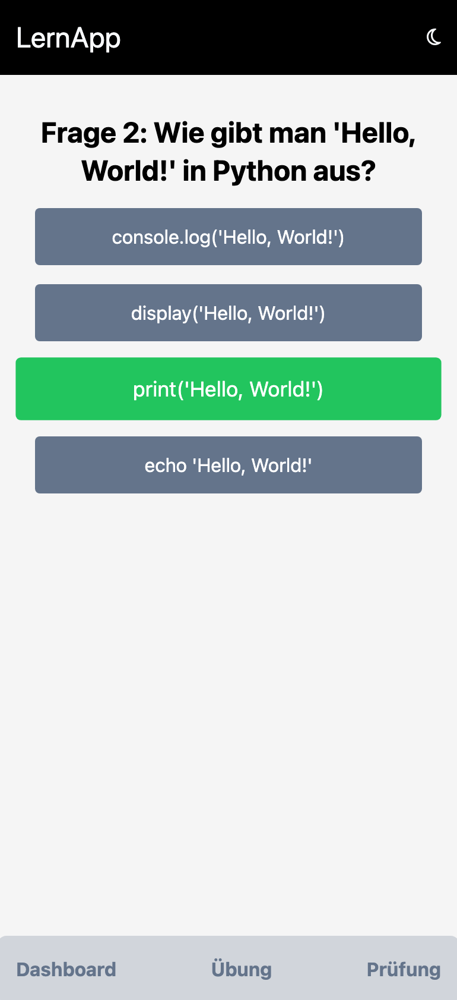
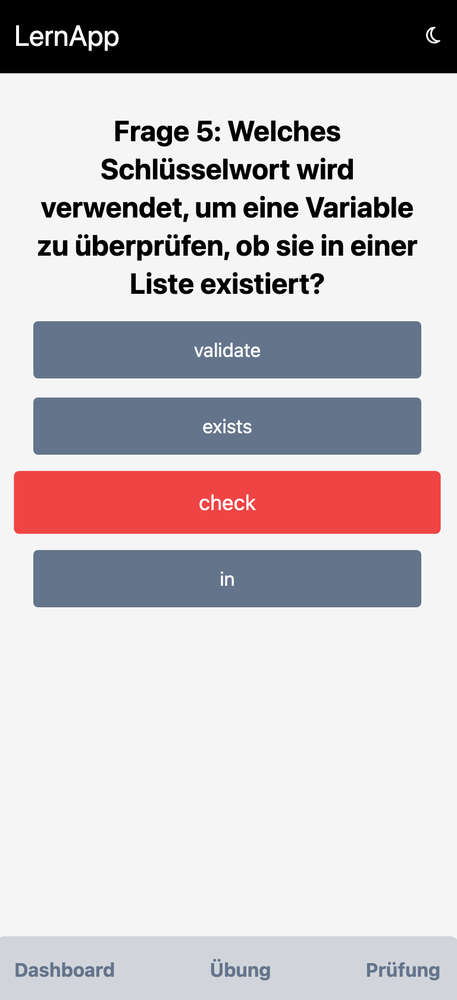
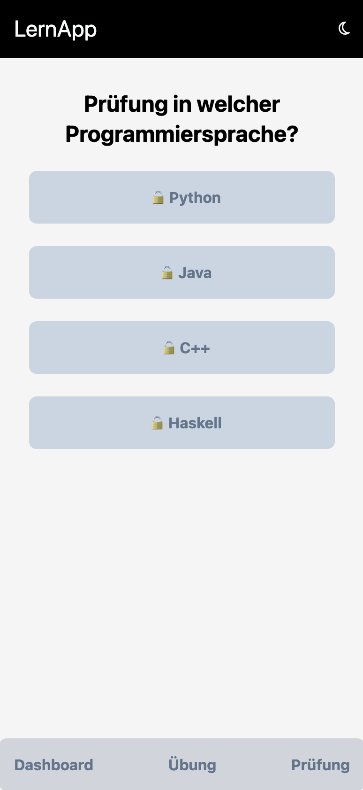
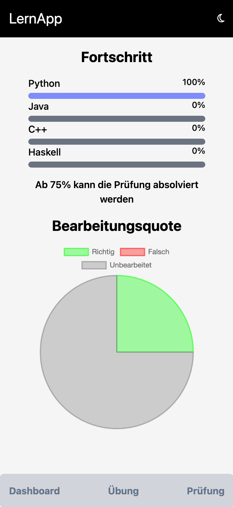
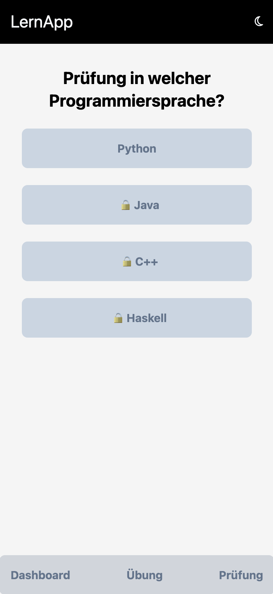
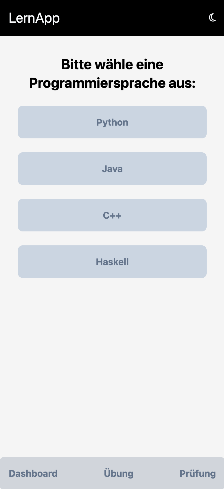
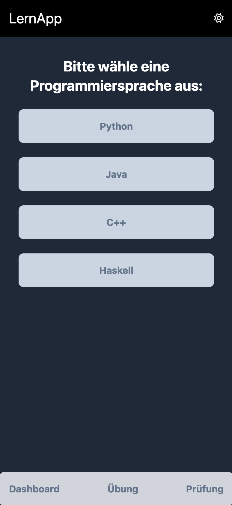

## Sie können die Anwendung direkt im Browser starten, indem Sie auf den ersten Link im Abschnitt "About" oben rechts klicken.

# LFP - Learn Fast Programming

## Warum LFP?

- **Idee:** Vereinfachter Start ins Programmieren
- **Gebündeltes Wissen an einem Ort**
- **PRG Quizze und Mimo als Vorbild**

## Ziele von LFP?

- **Schnellere Lernfortschritte durch interaktive Quizfragen**
- **Flexibles Lernen unabhängig von Ort und Zeit**
- **Selbstbestimmtes Lerntempo**
- **Breites Wissensspektrum abdecken**

## Funktionen

- **Große Auswahl an Programmiersprachen**
- **Fortschritts- und Leistungstracking**
- **Trennung zwischen Übungsaufgaben und Prüfungsaufgaben**
- **Sofortiges Feedback**
- **Darkmode**
- **Speichern des aktuellen Fortschritts**

## Dashboard

- **App startet bei dem Dashboard**
- **Überblick über Fortschritte und Leistungstracking**
- **Möglichkeit auf die Übungen oder zu den Prüfungen zu wechseln**

## Übungen

- **Nach Auswahl der Programmiersprache stehen 4 Übungen zur Auswahl**
- **Stufenweise höhere Schwierigkeit**
- **Übung 1-3 Abfragen**
- **Übung 4 Codeschnipsel ausfüllen**

## Prüfungsmodus

- **Kein direktes Feedback**
- **Testen, ob der User die Übungen verstanden hat**
- **Bewertung kommt zum Schluss**

## Darkmode

- **Mehr Augenkomfort bei schwachen Licht**
- **Energieeffizienz**
- **Barrierefreiheit**

## Frameworks

- **Next.js als React Framework**
- **Libraries:**
  - **Tailwind (Design)**
  - **Fontawesome (Icons)**
  - **Chart.js**

## Ausblick

- **Dashboard Erweiterungen/Statistiken für einzelne Programmiersprachen**
- **Mehr praktische Übungen (selbst programmieren)**
- **Theorie Bereich und Erklärungen**

## Aufgabenteilung

- **Sinan - Dashboard**
- **Danilo - Übungssimulation**
- **Ali - Prüfungssimulation**
